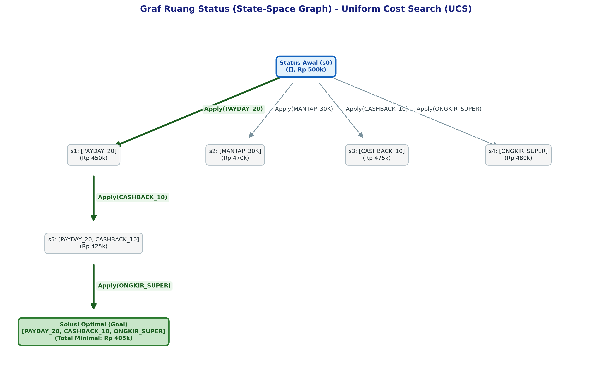

# E-Commerce Voucher Optimization Copilot

Solusi optimasi penumpukan (*stacking*) voucher belanja berbasis algoritma **Uniform Cost Search (UCS)** untuk menemukan kombinasi diskon terbaik dengan total pengeluaran paling minimal.

Proyek ini dibangun untuk memenuhi kualifikasi Tugas Praktikum Kecerdasan Buatan (Institut Teknologi Del).

---

## 👥 Tim Penyusun

* **12S24004** - Silvia Sitorus
* **12S24007** - Dasmauli Sormin
* **12S24022** - Ingrate Sihombing

---

## 📐 Diagram Arsitektur Ruang Keadaan (State-Space Graph)

Berikut adalah visualisasi alur pencarian ruang keadaan (*state-space graph*) yang dieksplorasi oleh algoritma UCS dari status awal hingga mencapai status tujuan (*Goal State*):

---

## 🛠️ Lingkungan Pengembang (Environment & Tooling)

Proyek ini dikelola menggunakan **Astral `uv`** untuk memastikan manajemen dependensi yang terisolasi, efisien, dan reproducible.

- **Bahasa Pemrograman**: Python 3.11+
- **Manajer Paket**: Astral `uv`
- **Visualisasi Graf**: `networkx`, `matplotlib`
- **Code Formatter & Linter**: `ruff`

---